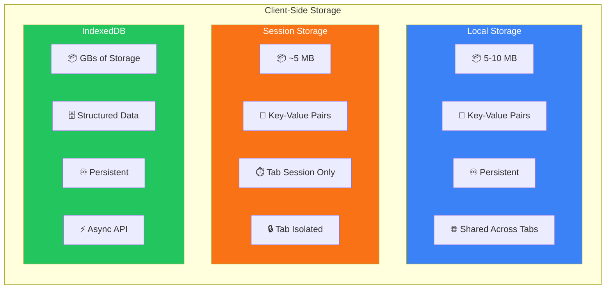
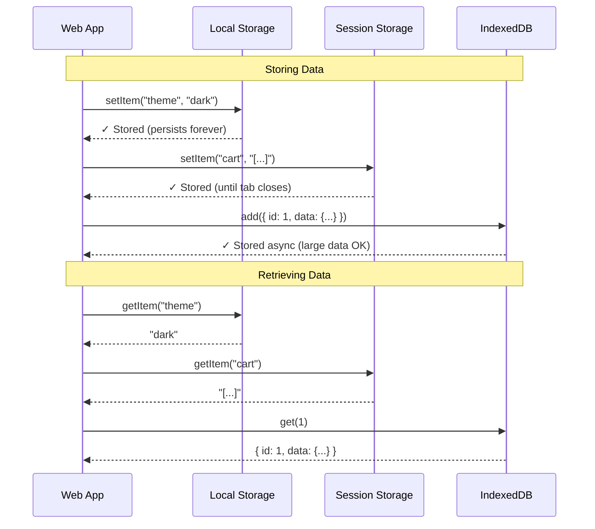
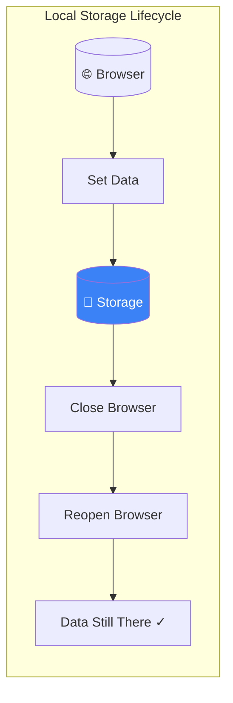
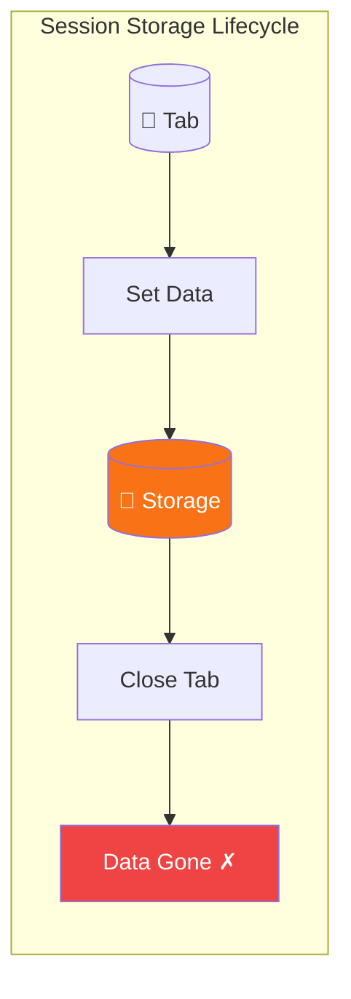
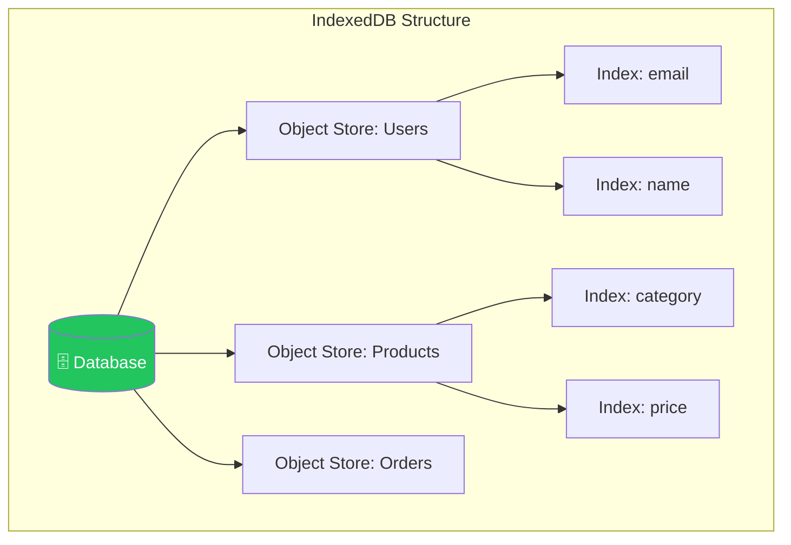
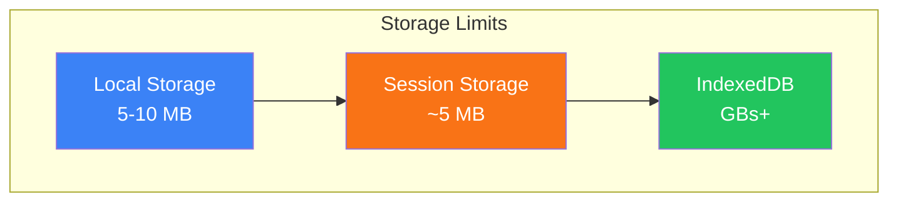
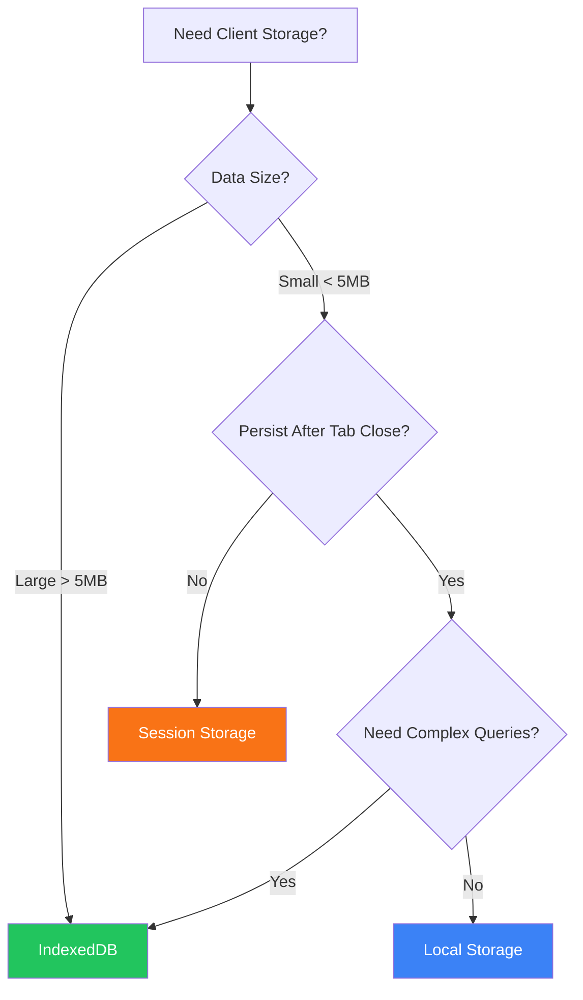

# Client-Side Storage: Choosing the Right Option

> Modern web apps demand fast, seamless experiences. Understanding client-side storage is key to delivering that.

In the web development landscape, choosing the correct client-side storage option is crucial for creating responsive and effective applications. With growing user expectations for fast and seamless experiences, understanding how to utilize **Local Storage**, **Session Storage**, and **IndexedDB** is paramount.

---

## Storage Options Overview



---

## How Data Flows in Each Storage



---

## Understanding the Three Storage Options

### 1. Local Storage <HardDrive className="inline w-5 h-5 text-blue-500" />

Persistent key-value storage that survives browser restarts.



Local Storage is a web storage mechanism that allows you to store data persistently in a key/value pair format. Its data doesn't expire, meaning that even after the browser is closed and reopened, the data will still be accessible.

#### Key Facts

| Property | Value |
|----------|-------|
| **Persistence** | Data never expires until explicitly deleted |
| **Capacity** | 5-10 MB |
| **Data Type** | Strings only (serialize objects with `JSON.stringify`) |
| **Scope** | Shared across all tabs of the same domain |

#### API Methods

```js
// Set item
localStorage.setItem("key", "value");

// Get item
let data = localStorage.getItem("key"); // "value"

// Remove specific item
localStorage.removeItem("key");

// Clear all items
localStorage.clear();
```

---

### 2. Session Storage <Clock className="inline w-5 h-5 text-orange-500" />

Temporary storage that lasts only for the current tab session.



Session Storage functions similarly to Local Storage, but with one key difference: the data stored in Session Storage is only available for the duration of the page session. Once the tab or window is closed, all data is lost.

#### Key Facts

| Property | Value |
|----------|-------|
| **Persistence** | Cleared when tab/window closes |
| **Capacity** | ~5 MB |
| **Data Type** | Strings only |
| **Scope** | Tab-specific - not shared between tabs |

#### API Methods

```js
// Set item
sessionStorage.setItem("sessionKey", "sessionValue");

// Get item
let sessionData = sessionStorage.getItem("sessionKey"); // "sessionValue"

// Remove specific item
sessionStorage.removeItem("sessionKey");

// Clear all items
sessionStorage.clear();
```

---

### 3. IndexedDB <Database className="inline w-5 h-5 text-green-500" />

Full NoSQL database in the browser for large, structured data.



IndexedDB is a full-fledged NoSQL database that operates on the client-side. It allows for the storage of large amounts of structured data, including files/blobs, in ways that can be more efficiently queried. IndexedDB is asynchronous and provides a richer set of features compared to the other two storage options.

#### Key Facts

| Property | Value |
|----------|-------|
| **Persistence** | Until explicitly deleted |
| **Capacity** | Hundreds of MBs to GBs |
| **Data Type** | Complex data types (objects, files, blobs) |
| **Scope** | Shared across all tabs |
| **API** | Asynchronous - won't block UI |

#### Basic Example

```js
let request = indexedDB.open("myDatabase", 1);

request.onupgradeneeded = function (event) {
  let db = event.target.result;
  db.createObjectStore("myObjectStore", { keyPath: "id" });
};

request.onsuccess = function (event) {
  let db = event.target.result;
  let transaction = db.transaction("myObjectStore", "readwrite");
  let store = transaction.objectStore("myObjectStore");
  store.add({ id: 1, name: "Sample" });
};
```

---

## Key Differences at a Glance

| Feature | Local Storage | Session Storage | IndexedDB |
|---------|---------------|-----------------|-----------|
| **Data Persistence** | Until explicitly deleted | Until tab/window closes | Until explicitly deleted |
| **Storage Limit** | ~5-10 MB | ~5-10 MB | Up to thousands of MB |
| **Data Type** | String only | String only | Structured data |
| **API Complexity** | Simple | Simple | Complex |
| **Shared Across Tabs** | Yes | No | Yes |
| **Async Support** | No | No | Yes |

---

## Storage Capacity Comparison



---

## Decision Flowchart



---

## When to Use Each Storage Option

### Use Local Storage When: <CheckCircle className="inline w-5 h-5 text-green-500" />

- You need to store **user preferences** or settings that should persist between sessions
- You have **limited data** (e.g., user themes or language choices)
- **Offline capabilities** are essential, and you want to keep data available even when users return later

### Use Session Storage When: <CheckCircle className="inline w-5 h-5 text-green-500" />

- Your data is **session-specific** and doesn't need to persist post-session (e.g., shopping cart for an ongoing session)
- You want to store **temporary data** that doesn't need to be shared across different tabs or windows
- Keeping the storage **simple and lightweight** is a priority

### Use IndexedDB When: <CheckCircle className="inline w-5 h-5 text-green-500" />

- You need to store and manage **large amounts of structured data** or files with complex queries
- **Offline access** to data is critical, especially for applications that need to sync later
- Data needs to be organized with **indexing for quicker retrieval**

---

## Pros and Cons

### Local Storage

| Pros | Cons |
|------|------|
| <CheckCircle className="inline w-4 h-4 text-green-500" /> Easy to implement and use | <XCircle className="inline w-4 h-4 text-red-500" /> Limited storage capacity (~5-10MB) |
| <CheckCircle className="inline w-4 h-4 text-green-500" /> Data persists indefinitely until manually deleted | <XCircle className="inline w-4 h-4 text-red-500" /> Only stores strings, requiring serialization for other data types |

### Session Storage

| Pros | Cons |
|------|------|
| <CheckCircle className="inline w-4 h-4 text-green-500" /> Simple API similar to Local Storage | <XCircle className="inline w-4 h-4 text-red-500" /> Limited to per-tab storage, preventing data sharing between multiple tab instances |
| <CheckCircle className="inline w-4 h-4 text-green-500" /> Data is automatically removed when the session ends, reducing clutter | <XCircle className="inline w-4 h-4 text-red-500" /> Same size limitations apply as with Local Storage |

### IndexedDB

| Pros | Cons |
|------|------|
| <CheckCircle className="inline w-4 h-4 text-green-500" /> Supports storing complex data types and much larger amounts of data | <XCircle className="inline w-4 h-4 text-red-500" /> Complex API, requiring more learning and understanding |
| <CheckCircle className="inline w-4 h-4 text-green-500" /> Asynchronous API can handle large datasets without blocking the UI | <XCircle className="inline w-4 h-4 text-red-500" /> Performance can be slower for simple operations compared to Local and Session Storage |

---

## Quick Decision Guide <Zap className="inline w-5 h-5 text-yellow-500" />

| Your Need | Best Choice |
|-----------|-------------|
| Simple user settings that persist | **Local Storage** |
| Temporary session data | **Session Storage** |
| Large/complex data + offline support | **IndexedDB** |

```
Simple + Persistent    → Local Storage
Simple + Temporary     → Session Storage
Complex + Large        → IndexedDB
```

---

## Conclusion

Choosing the right client-side storage mechanism depends mainly on the specific needs of your application:

- For **straightforward data storage** like user settings, **Local Storage** is a solid choice
- If your data only needs to last for a **session**, then **Session Storage** is ideal
- For applications that require storing and retrieving **large amounts of structured data**, **IndexedDB** is the optimal solution

As a developer, understanding these options enables you to enhance user experience through efficient data management. Consider your application's requirements, test different methods, and implement the storage solution that best suits your needs.

> By keeping in mind the strengths and weaknesses of each storage type, you will be able to build more resilient and efficient web applications that meet and exceed user expectations.
