# HTTP Caching

> The HTTP cache stores a response associated with a request and reuses it for subsequent requests.

---

## How HTTP Caching Works

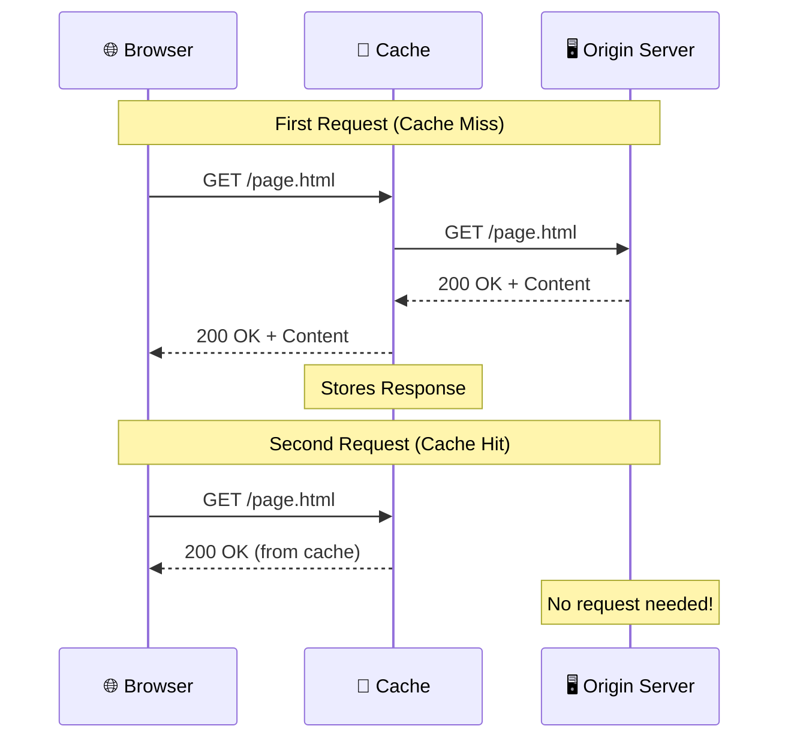

---

## Why Caching Matters

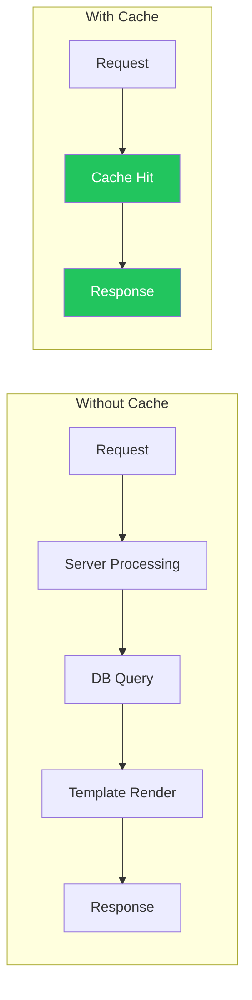

| Benefit | Description |
|---------|-------------|
| **Faster Response** | Closer cache = faster delivery (no round-trip to origin) |
| **Reduced Server Load** | No parsing, routing, DB queries, or template rendering |
| **Better UX** | Instant page loads for returning visitors |
| **Lower Bandwidth** | Less data transferred over the network |

---

## Types of Caches

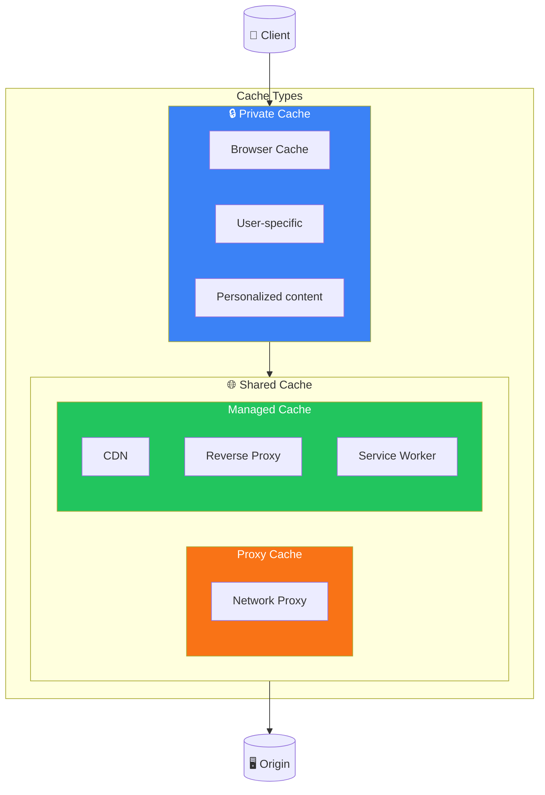

### 1. Private Cache

A cache tied to a **specific client** (typically browser cache).

```http
Cache-Control: private
```

| Property | Value |
|----------|-------|
| **Scope** | Single user/browser |
| **Use Case** | Personalized content |
| **Shared** | No - prevents information leakage |

> **Important:** Cookies don't automatically make a response private. You must explicitly set `Cache-Control: private` for personalized content.

---

### 2. Shared Cache

Located **between client and server**, shared among multiple users.

#### Proxy Caches

- Implemented by network proxies
- Not managed by developers
- Controlled via HTTP headers
- Less relevant with HTTPS (encrypted traffic can't be cached by proxies)

#### Managed Caches

Explicitly deployed by developers for performance:

| Type | Examples |
|------|----------|
| **Reverse Proxies** | Nginx, Varnish |
| **CDNs** | Cloudflare, AWS CloudFront, Fastly |
| **Service Workers** | Browser Cache API |

```http
# Opt-out of proxy/private cache, use only managed cache
Cache-Control: no-store
```

---

## Fresh vs Stale Responses

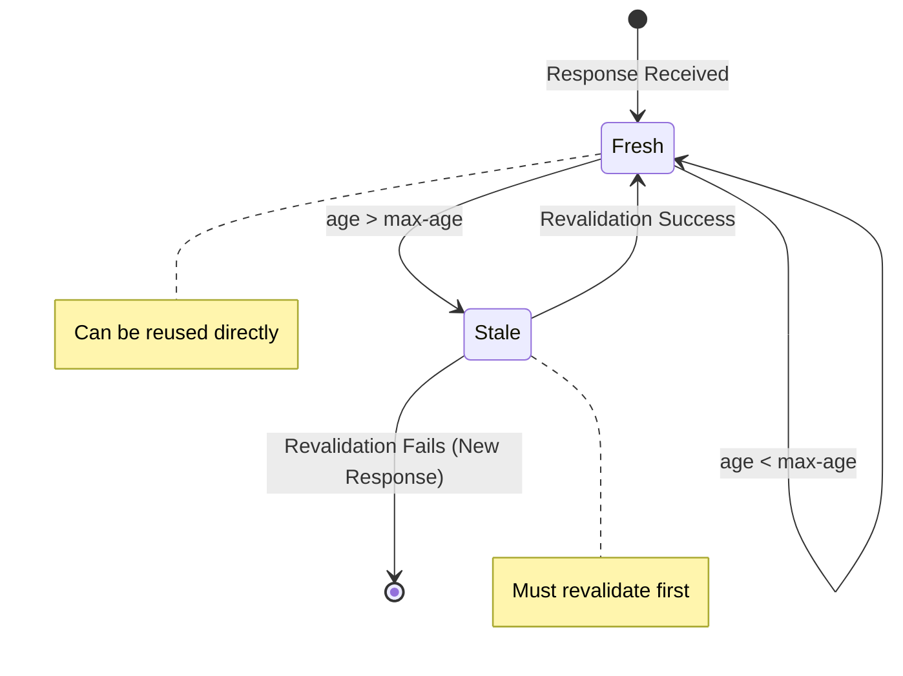

Cached responses have two states:

| State | Meaning |
|-------|---------|
| **Fresh** | Valid, can be reused |
| **Stale** | Expired, needs revalidation |

### Age Calculation

**Age** = time elapsed since response was generated (similar to TTL).

```http
HTTP/1.1 200 OK
Content-Type: text/html
Date: Tue, 22 Feb 2022 22:22:22 GMT
Cache-Control: max-age=604800

<!doctype html>...
```

- `max-age=604800` = 1 week (in seconds)
- **Fresh** if age < 1 week
- **Stale** if age > 1 week

### Shared Cache Age Header

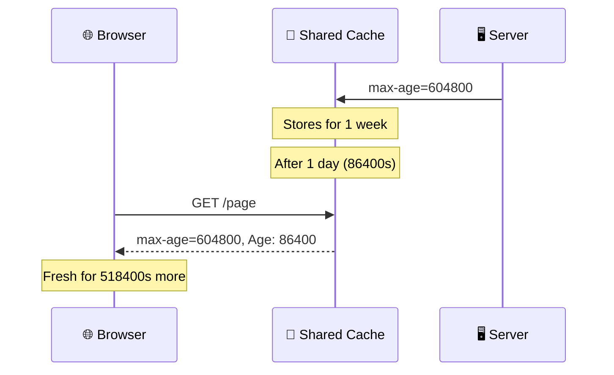

---

## Cache-Control Directives

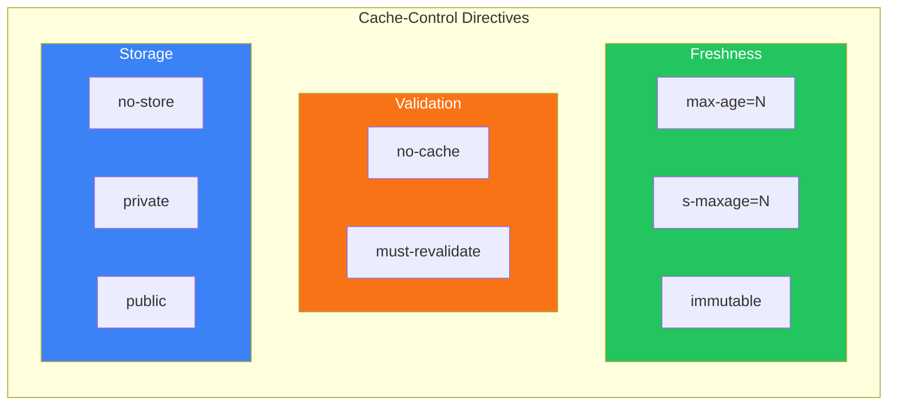

### Freshness Directives

| Directive | Purpose |
|-----------|---------|
| `max-age=<seconds>` | Response is fresh for N seconds |
| `s-maxage=<seconds>` | Same as max-age but for shared caches only |
| `no-cache` | Must revalidate before reuse |
| `no-store` | Don't store the response at all |
| `private` | Only store in private (browser) cache |
| `public` | Can be stored even with Authorization header |
| `immutable` | Content never changes, skip revalidation on reload |
| `must-revalidate` | Must revalidate when stale (no serving stale content) |

### Expires vs max-age

```http
# Old way (HTTP/1.0) - avoid
Expires: Tue, 28 Feb 2022 22:22:22 GMT

# Modern way (HTTP/1.1) - preferred
Cache-Control: max-age=604800
```

> **Rule:** If both exist, `max-age` takes precedence.

---

## Validation (Revalidation)

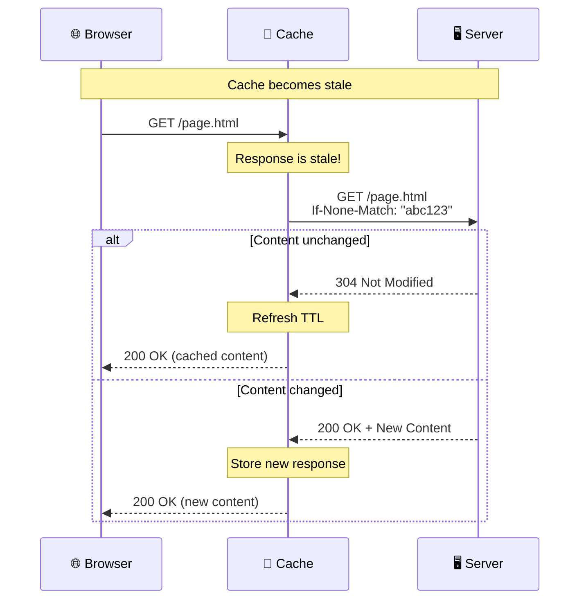

Stale responses aren't discarded - they can be **revalidated** with the origin server.

### Method 1: If-Modified-Since

Uses `Last-Modified` timestamp:

```http
# Original Response
HTTP/1.1 200 OK
Last-Modified: Tue, 22 Feb 2022 22:00:00 GMT
Cache-Control: max-age=3600
```

```http
# Revalidation Request
GET /index.html HTTP/1.1
If-Modified-Since: Tue, 22 Feb 2022 22:00:00 GMT
```

```http
# Server Response (not modified)
HTTP/1.1 304 Not Modified
Cache-Control: max-age=3600
```

**Result:** No body transferred, cache refreshed for another hour.

---

### Method 2: ETag / If-None-Match

Uses content hash or version identifier:

```http
# Original Response
HTTP/1.1 200 OK
ETag: "33a64df5"
Cache-Control: max-age=3600
```

```http
# Revalidation Request
GET /index.html HTTP/1.1
If-None-Match: "33a64df5"
```

```http
# Server Response (not modified)
HTTP/1.1 304 Not Modified
```

| Method | Pros | Cons |
|--------|------|------|
| **Last-Modified** | Easy for static files | Time sync issues on distributed servers |
| **ETag** | Precise, works everywhere | Requires hash computation |

> **Best Practice:** Send both `ETag` and `Last-Modified` when possible.

---

## The Vary Header

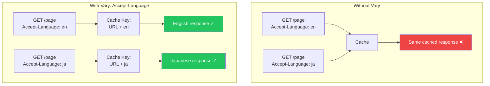

Cache responses separately based on request headers:

```http
Vary: Accept-Language
```

| URL | Accept-Language | Cached Separately |
|-----|-----------------|-------------------|
| `/index.html` | `ja-JP` | Yes |
| `/index.html` | `en-US` | Yes |

> **Warning:** Avoid `Vary: User-Agent` - too many variations, kills cache hit rate. Use feature detection instead.

---

## Common Caching Patterns

### Pattern 1: Default Settings

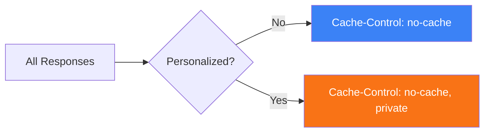

Always validate, never serve stale:

```http
# Non-personalized content
Cache-Control: no-cache

# Personalized content
Cache-Control: no-cache, private
```

---

### Pattern 2: Cache Busting (Static Assets)

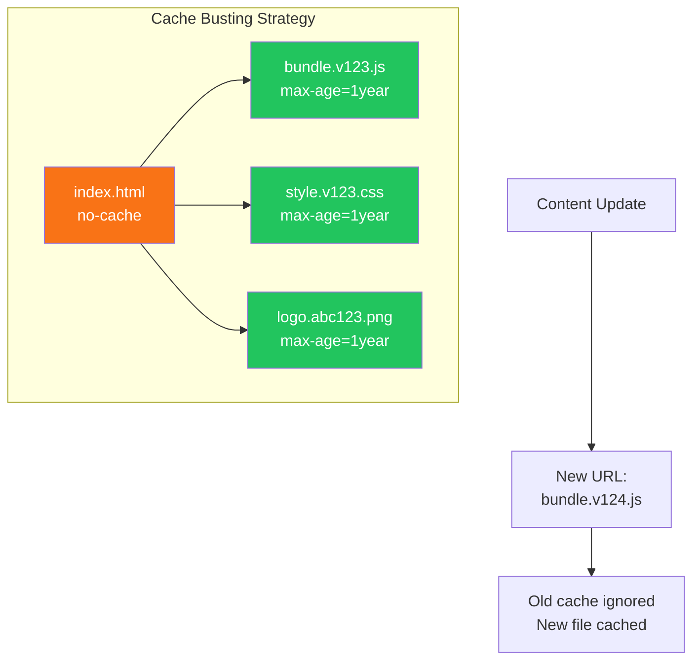

For JS, CSS, images - cache forever with versioned URLs:

```html
<!-- Before -->
<script src="bundle.js"></script>

<!-- After (cache busting) -->
<script src="bundle.v123.js"></script>
<script src="bundle.js?v=123"></script>
<script src="bundle.YsAIAAAA.js"></script>
```

```http
# Response for versioned assets
HTTP/1.1 200 OK
Cache-Control: public, max-age=31536000, immutable
Last-Modified: Tue, 22 Feb 2022 20:20:20 GMT
ETag: "YsAIAAAA-QG4G6kCMAMBAAAAAAAoK"
```

| max-age Value | Duration | QPACK Index |
|---------------|----------|-------------|
| `604800` | 1 week | 37 |
| `2592000` | 1 month | 38 |
| `31536000` | 1 year | 41 |

---

### Pattern 3: Main Resources (HTML)

Can't use cache busting (URLs are fixed):

```http
# Non-personalized HTML
HTTP/1.1 200 OK
Content-Type: text/html
Cache-Control: no-cache
Last-Modified: Tue, 22 Feb 2022 20:20:20 GMT
ETag: "AAPuIbAOdvAGEETbgAAAAAAABAAE"
```

```http
# Personalized HTML (after login)
HTTP/1.1 200 OK
Content-Type: text/html
Cache-Control: no-cache, private
Last-Modified: Tue, 22 Feb 2022 20:20:20 GMT
ETag: "AAPuIbAOdvAGEETbgAAAAAAABAAE"
Set-Cookie: __Host-SID=AHNtAyt3fvJrUL5g5tnGwER; Secure; Path=/; HttpOnly
```

---

## Don't Cache vs No-Store

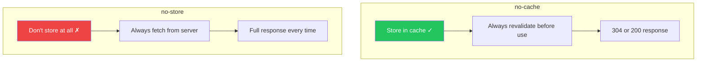

### no-cache ≠ "Don't Cache"

| Directive | Behavior |
|-----------|----------|
| `no-cache` | Store, but always revalidate before use |
| `no-store` | Don't store at all |

### When to Use What

| Scenario | Use This |
|----------|----------|
| Personalized content | `Cache-Control: private` |
| Always fresh content | `Cache-Control: no-cache` |
| Sensitive data | `Cache-Control: no-cache, private` |

> **Avoid:** `no-store` loses browser back/forward cache benefits. Prefer `no-cache, private`.

---

## Reload vs Force Reload

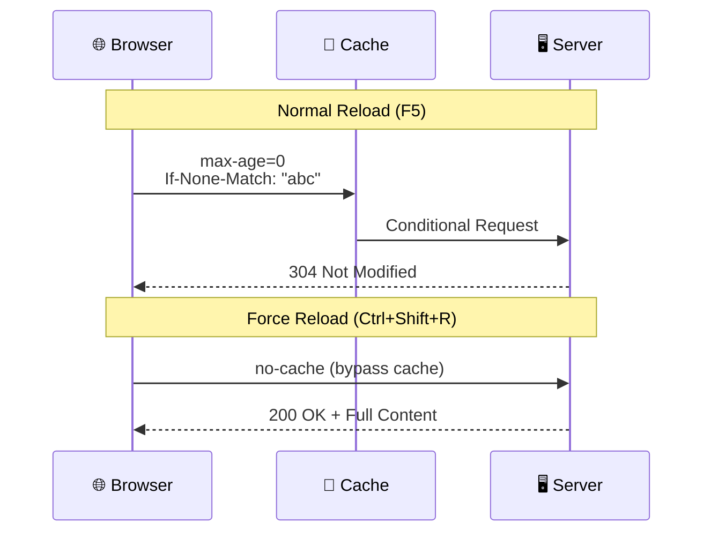

### Normal Reload

```http
GET / HTTP/1.1
Cache-Control: max-age=0
If-None-Match: "deadbeef"
If-Modified-Since: Tue, 22 Feb 2022 20:20:20 GMT
```

```js
// JavaScript equivalent
fetch("/", { cache: "no-cache" });
```

### Force Reload (Ctrl+Shift+R)

```http
GET / HTTP/1.1
Pragma: no-cache
Cache-Control: no-cache
```

```js
// JavaScript equivalent
fetch("/", { cache: "reload" });
```

---

## Request Collapse

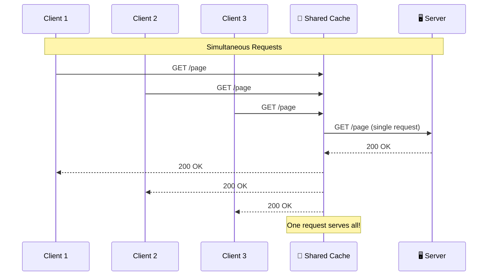

When multiple identical requests hit a shared cache simultaneously:

1. Cache forwards **one request** to origin
2. Reuses response for **all clients**

> **Note:** Add `private` directive if response is personalized to prevent sharing.

---

## Caching Decision Flowchart

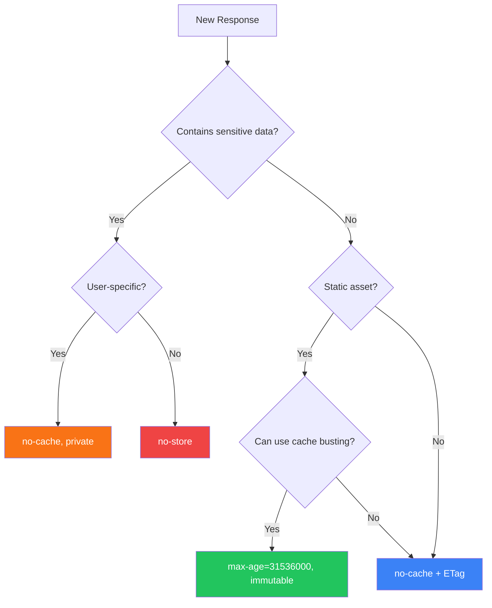

---

## Quick Reference

### Static Assets (JS, CSS, Images)

```http
Cache-Control: public, max-age=31536000, immutable
ETag: "hash-value"
Last-Modified: <date>
```

### HTML Pages

```http
Cache-Control: no-cache
ETag: "hash-value"
Last-Modified: <date>
```

### Personalized Content

```http
Cache-Control: no-cache, private
```

### API Responses

```http
# Cacheable
Cache-Control: private, max-age=60

# Not cacheable
Cache-Control: no-cache, private
```

---

## Summary

| Content Type | Cache Strategy |
|--------------|----------------|
| Static assets (versioned) | `max-age=31536000, immutable` |
| HTML documents | `no-cache` + ETag |
| Personalized content | `no-cache, private` |
| API responses | Depends on freshness needs |

> **Golden Rule:** Always set explicit `Cache-Control` headers. Don't rely on heuristic caching.
